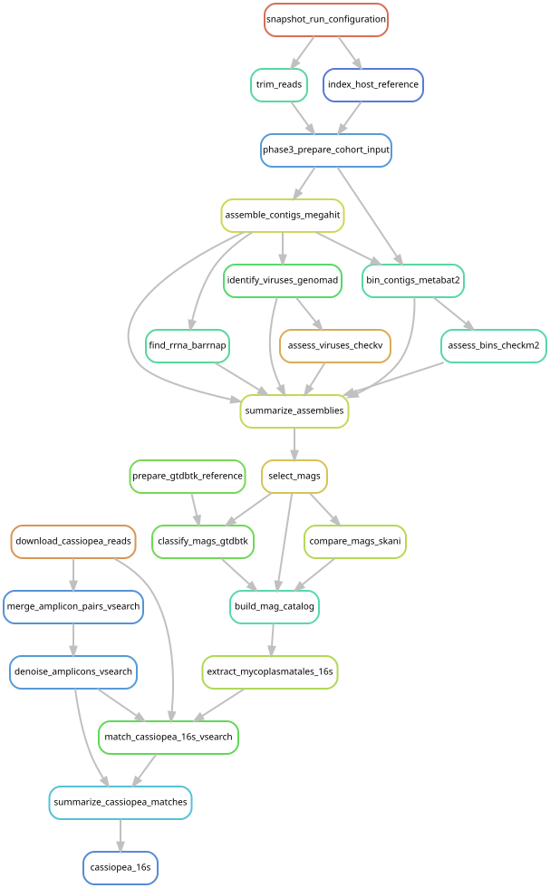

# Compare Cassiopea tissues and environmental samples

[Workflow index](../README.md) · [Source rules](../../../workflow/rules/cassiopea_16s.smk)

Search an independent upside-down jellyfish dataset for bacterial 16S sequences
related to the siphonophore Mycoplasmatales. Compare tissue categories with water,
sediment and swab samples while retaining the distinctions between Illumina
amplicons and PacBio full-length marker reads.

## Inputs and products

[config/cassiopea_16s_runs.tsv](../../../config/cassiopea_16s_runs.tsv) fixes ENA
read URLs, checksums and sample metadata.
[config/cassiopea_16s.json](../../../config/cassiopea_16s.json) sets primers, filtering,
denoising and match criteria. The reference markers come from
[cnidarian 16S extraction](../cnidarian_16s/README.md).
Products in `data/results/cassiopea_16s/` include filtered reads, denoised variants,
match tables and `summary/{sample_matches,sample_type_summary,pacbio_summary}.tsv`.

## Steps and rules

1. `download_cassiopea_reads` retrieves reads and checks the manifest MD5 values.
2. `merge_amplicon_pairs_vsearch` merges Illumina pairs, strips the configured
   primer lengths and filters errors/lengths; `denoise_amplicons_vsearch` removes
   redundancy/chimeras and counts reads against denoised variants.
3. `match_cassiopea_16s_vsearch` searches variants and length-filtered PacBio reads
   against MAG 16S genes, retaining the best gene match per variant/read.
4. `summarize_cassiopea_matches` reports per-sample, sample-type and PacBio summaries;
   `cassiopea_16s` requests all three summaries.

## Interpretation and graph boundary

Candidate matches start at 90% identity to retain divergent relatives. Full-query
coverage is enforced in the Illumina variant search. The PacBio search records
coverage, but neither that search nor the summary imposes the same coverage
threshold; its summary groups matches by identity. The two branches therefore
have different alignment-coverage criteria. Illumina reads are filtered to
380–480 bases and PacBio reads to 1,300–1,700 bases in the current configuration.

Read fractions and identities describe this dataset; shared markers alone do not
establish host specificity or a shared bacterial genome. See
[the context report](../../mycoplasmatales_context_results.md). The graph includes
MAG-marker extraction and its catalog dependencies, but it does not include the
six external cnidarian database libraries, which this analysis does not consume.

## Preview, launch and rule graph

Run from the repository root after the [shared environment setup](../README.md#environment-and-inputs).
The preview evaluates dependencies without executing analysis jobs. The launch
command submits the same scope through the existing cluster controller.
This scope can build missing upstream products; it is not restricted to this one rule file.

```bash
# Preview only.
snakemake cassiopea_16s \
  --snakefile Snakefile --configfile config/config.yaml \
  --cores 1 --dry-run --rerun-triggers mtime

# Execute this scope on the cluster (not needed to view or regenerate graphs).
bash scripts/submit_workflow.sh cassiopea_16s config/config.yaml
```



Generated by Snakemake from `Snakefile`, `config/config.yaml`, targets `cassiopea_16s`.
All declared upstream rules needed by these targets are included.
Repeated jobs collapse to one node per rule; arrows point from producers to consumers.
See [graph limits and freshness checks](../README.md#regenerate-and-check-the-graphs).

```bash
# Documentation only; never executes analysis rules.
./scripts/update_rulegraphs.py cassiopea
./scripts/update_rulegraphs.py cassiopea --check
```
