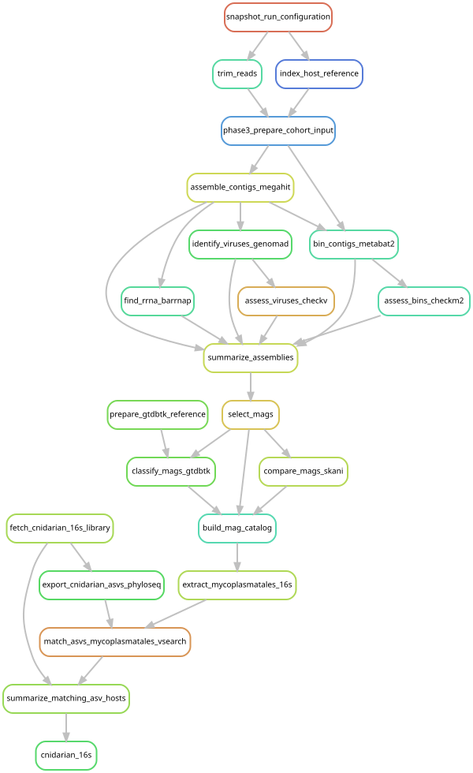

# Look for matching bacterial markers across cnidarians

[Workflow index](../README.md) · [Source rules](../../../workflow/rules/cnidarian_16s.smk)

Compare 16S genes from the recovered Mycoplasmatales with the Cnidarian Microbiome
Database. An amplicon sequence variant (ASV) is a distinct marker-gene sequence
in the processed amplicon data. This analysis asks which sampled hosts carry
similar markers, rather than assembling additional genomes.

## Inputs and products

[config/cnidarian_16s.json](../../../config/cnidarian_16s.json) identifies six
McCauley et al. database libraries, their Figshare file IDs/MD5s, the minimum MAG
marker length and matching thresholds. Inputs also include the MAG catalog and
source assemblies/marker calls. Products in `data/results/cnidarian_16s/` include
downloaded R objects, ASV FASTAs/taxonomy, `mycoplasmatales_mag_16s.fasta`,
`asv_matches.tsv`, `matching_asv_samples.tsv` and `matching_asv_hosts.tsv`.

## Steps and rules

1. `fetch_cnidarian_16s_library` downloads each database object and checks its MD5.
2. `export_cnidarian_asvs_phyloseq` extracts sequences and taxonomy from the R objects.
3. `extract_mycoplasmatales_16s` recovers MAG-associated 16S genes at least 1,200 bases.
4. `match_asvs_mycoplasmatales_vsearch` searches both strands at at least 97%
   identity over the complete ASV query length, retaining alternative matches.
5. `summarize_matching_asv_hosts` joins matches to sample/host information;
   `cnidarian_16s` requests the host summary.

## Interpretation and handoff

The six libraries cover different short 16S regions. Even an identical short
marker is not genome-level species identity, and database sampling determines
which hosts can be compared. See [the context report](../../mycoplasmatales_context_results.md).

The 16S extraction script reads source assemblies and marker calls from a results
directory passed as a parameter; the catalog is the declared dependency, so the
individual source-file reads are not all visible as graph edges.
[Cassiopea analysis](../cassiopea_16s/README.md) reuses the extracted MAG markers,
without requiring the complete cnidarian database comparison to run first.

## Preview, launch and rule graph

Run from the repository root after the [shared environment setup](../README.md#environment-and-inputs).
The preview evaluates dependencies without executing analysis jobs. The launch
command submits the same scope through the existing cluster controller.
This scope can build missing upstream products; it is not restricted to this one rule file.

```bash
# Preview only.
snakemake cnidarian_16s \
  --snakefile Snakefile --configfile config/config.yaml \
  --cores 1 --dry-run --rerun-triggers mtime

# Execute this scope on the cluster (not needed to view or regenerate graphs).
bash scripts/submit_workflow.sh cnidarian_16s config/config.yaml
```



Generated by Snakemake from `Snakefile`, `config/config.yaml`, targets `cnidarian_16s`.
All declared upstream rules needed by these targets are included.
Repeated jobs collapse to one node per rule; arrows point from producers to consumers.
See [graph limits and freshness checks](../README.md#regenerate-and-check-the-graphs).

```bash
# Documentation only; never executes analysis rules.
./scripts/update_rulegraphs.py cnidarian
./scripts/update_rulegraphs.py cnidarian --check
```
