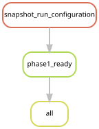

# Shared configuration and read-routing decisions

[Workflow index](../README.md) · [Source rules](../../../workflow/rules/common.smk)

This file loads the settings shared by the workflow and chooses which libraries,
read pairs and reference genomes each stage uses. It contains **no executable
rules**, so there is no standalone `common` analysis or rule node. The graph below
shows the production `all` target whose output this file selects.

## Inputs and products

The root [Snakefile](../../../Snakefile) reads
[config/config.yaml](../../../config/config.yaml) and the included rows of
[config/samples.tsv](../../../config/samples.tsv). `common.smk` then reads the
Phase 3–6 JSON configurations, benchmark panel, frozen assembly membership,
sensitivity subsets and eukaryote settings. It defines Python values and helper
functions; it writes no result files while the workflow is loaded.

## Decisions to audit

- `raw_r1` / `raw_r2`: source FASTQs in production; generated small read sets in
  fixture mode. A fixture is a small test dataset, not a biological cohort.
- `host_route` / `host_index_inputs`: select a Physalia or Nanomia host reference,
  or no host reference, from the sample table.
- `phase3_read_input`: benchmark-specific Kraken-selected, reference-depleted or
  fixed-effort reads, according to the frozen benchmark panel.
- `phase3_cohort_strategy`: host depletion where a reference exists; a fixed
  25-million-pair assembly subset otherwise. `ASSEMBLY_IDS` comes from the frozen
  membership table rather than recalculating eligibility during workflow loading.
- `phase5_reads`: host-depleted reads for reference-bearing libraries; full capped,
  quality-filtered reads for reference-free libraries. The latter are not limited
  to the smaller assembly subset.
- `phase6_sensitivity_reads`: full capped or uncapped reads for specified controls.
- `DEFAULT_TARGETS`: production `all` requests only `phase1_ready`. It does not
  request every analysis. Always name the desired scientific target explicitly.

The helper rejects duplicated benchmark/pilot identifiers and mismatched assembly
membership. These checks establish table consistency, not biological validity.
The [workflow index](../README.md) lists the downstream stages that use these
shared decisions. Taxon-specific settings are additionally loaded in their own
rule files. The displayed readiness graph belongs to `validation.smk`; shared
Python helpers do not become nodes in a Snakemake rule graph.

## Preview, launch and rule graph

Run from the repository root after the [shared environment setup](../README.md#environment-and-inputs).
The preview evaluates dependencies without executing analysis jobs. The launch
command submits the same scope through the existing cluster controller.
This scope can build missing upstream products; it is not restricted to this one rule file.

```bash
# Preview only.
snakemake all \
  --snakefile Snakefile --configfile config/config.yaml \
  --cores 1 --dry-run --rerun-triggers mtime

# Execute this scope on the cluster (not needed to view or regenerate graphs).
bash scripts/submit_workflow.sh all config/config.yaml
```



Generated by Snakemake from `Snakefile`, `config/config.yaml`, targets `all`.
All declared upstream rules needed by these targets are included.
Repeated jobs collapse to one node per rule; arrows point from producers to consumers.
See [graph limits and freshness checks](../README.md#regenerate-and-check-the-graphs).

```bash
# Documentation only; never executes analysis rules.
./scripts/update_rulegraphs.py readiness
./scripts/update_rulegraphs.py readiness --check
```
