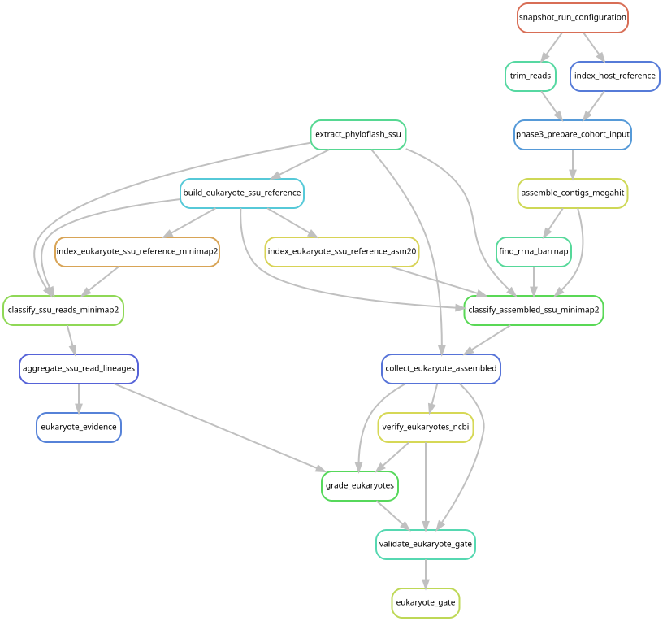

# Distinguish non-host eukaryotic SSU evidence

[Workflow index](../README.md) · [Source rules](../../../workflow/rules/eukaryote_gate.smk)

Use ribosomal small-subunit (SSU) sequences to assess candidate prey, parasites
and other eukaryotes while reducing confusion with the siphonophore host.
Read and assembly evidence are two ways of processing the same sequencing data.

## Inputs and products

Inputs are accepted phyloFlash archives/provenance, SILVA 138.1 sequences,
cohort-derived host SSUs, and ribosomal genes from eligible Phase 3 assemblies.
[config/eukaryote_gate.json](../../../config/eukaryote_gate.json) defines the grades;
[the decision record](../../eukaryote_gate_decisions.md) explains reporting units.
Products in `data/results/eukaryote_gate/` include `read_lineages.tsv`,
`assembled_nonhost.{tsv,fasta}`, `ncbi_verification.tsv` and `eukaryote_grades.tsv`.

## Steps and rules

1. `extract_phyloflash_ssu` extracts pairs and assembled SSUs;
   `build_eukaryote_ssu_reference` combines SILVA with host sequences.
2. `index_eukaryote_ssu_reference_minimap2` creates the short-read index;
   `classify_ssu_reads_minimap2` assigns pairs to the lowest common ancestor of
   near-tied hits. `aggregate_ssu_read_lineages` pools all libraries and
   `eukaryote_evidence` requests this read-only branch.
3. `index_eukaryote_ssu_reference_asm20` creates the long-sequence index;
   `classify_assembled_ssu_minimap2` classifies phyloFlash assemblies and extracted
   Phase 3 18S genes; `collect_eukaryote_assembled` collects non-host sequences.
4. `verify_eukaryotes_ncbi` obtains external sequence verification.
5. `grade_eukaryotes` combines the evidence; `validate_eukaryote_gate` checks it;
   `eukaryote_gate` requests the complete graded branch.

## Interpretation and graph boundary

`eukaryote_evidence` alone does not request final grades. Both entry points appear
below to make that distinction visible. Accepted phyloFlash archives are resolved
through checksum-checked provenance passed as a parameter; the graph therefore
starts that branch at extraction rather than at the original screen.

Reported groups use conservative taxonomic and ecological assignments. Repeated
markers do not count as independent species, and molecular detection does not
establish diet, infection or a living associate on its own. The targeted Waki
marker comparison is a separate analysis outside this rule file; see
[its methods and reproduction record](../../waki_sequence_comparison.md).

## Preview, launch and rule graph

Run from the repository root after the [shared environment setup](../README.md#environment-and-inputs).
The preview evaluates dependencies without executing analysis jobs. The launch
command submits the same scope through the existing cluster controller.
This scope can build missing upstream products; it is not restricted to this one rule file.

```bash
# Preview only.
snakemake eukaryote_evidence eukaryote_gate \
  --snakefile Snakefile --configfile config/config.yaml \
  --cores 1 --dry-run --rerun-triggers mtime

# Execute this scope on the cluster (not needed to view or regenerate graphs).
bash scripts/submit_workflow.sh 'eukaryote_evidence eukaryote_gate' config/config.yaml
```



Generated by Snakemake from `Snakefile`, `config/config.yaml`, targets `eukaryote_evidence eukaryote_gate`.
All declared upstream rules needed by these targets are included.
Repeated jobs collapse to one node per rule; arrows point from producers to consumers.
See [graph limits and freshness checks](../README.md#regenerate-and-check-the-graphs).

```bash
# Documentation only; never executes analysis rules.
./scripts/update_rulegraphs.py eukaryotes
./scripts/update_rulegraphs.py eukaryotes --check
```
