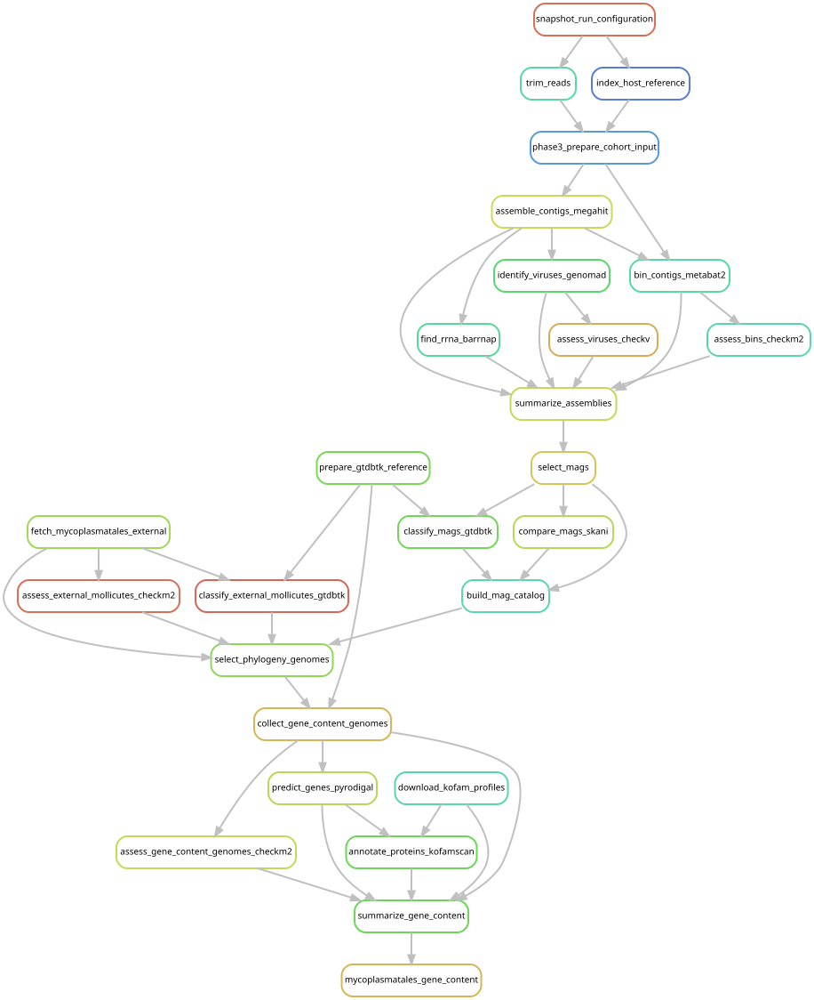

# Compare predicted metabolic capabilities

[Workflow index](../README.md) · [Source rules](../../../workflow/rules/mycoplasmatales_gene_content.smk)

Predict genes in focal Mollicutes genomes and compare their potential functions
with host-associated and GTDB Metamycoplasmataceae relatives. These annotations
measure genomic potential, not observed metabolic activity.

## Inputs and products

Inputs are selected genomes/labels from the phylogeny selection stage, GTDB r220
family representatives, CheckM2 data and KOfam protein profiles.
[config/mycoplasmatales_gene_content.json](../../../config/mycoplasmatales_gene_content.json)
sets genetic code 4, genome-quality criteria and assignment thresholds.
Products in `data/results/mycoplasmatales_gene_content/` include genomes, predicted
genes/proteins, `kofamscan.tsv`, download checksums and `summary/` tables for genome
statistics, KEGG orthologs (KOs), modules, lineages and focal functions.

## Steps and rules

1. `collect_gene_content_genomes` selects the comparison set;
   `assess_gene_content_genomes_checkm2` estimates completeness/contamination.
2. `download_kofam_profiles` retrieves profiles and the KO list, recording checksums.
3. `predict_genes_pyrodigal` predicts genes/proteins using the Mollicutes genetic code.
4. `annotate_proteins_kofamscan` searches proteins against KOfam profiles.
5. `summarize_gene_content` applies strict and calibrated relaxed KO assignments
   and scores modules. `mycoplasmatales_gene_content` requests the main summaries.

## Interpretation and handoff

Strict assignments pass the profile threshold. The configured relaxed tier uses
an E-value at most 1e-5 and score at least 0.6 times the threshold for proteins
without a strict assignment. Report both tiers and the calibration described in
[the plan](../../mycoplasmatales_gene_content_plan.md) and
[results](../../mycoplasmatales_gene_content_results.md).
Absence claims use near-complete genomes; MAGSP0031 supports gene-presence claims
only. Missing annotation in an incomplete genome is not reliable biological absence.

Module completeness is calculated by the installed `give_completeness` program
using its packaged KEGG module definitions. Those definitions are not separate
rule inputs, and the analysis configuration is passed to the summary script as
a parameter. These file reads are not separate graph edges. The KOfam URLs are mutable;
retained download checksums identify the analyzed release. The graph shares genome
selection with the phylogeny but does not require the final tree to be rebuilt.
Publication plots consume the completed summary tables.
The [MDB manuscript-review summary](../../mdb_revision.md) also reuses these
tables for selected nutritional and defense annotations without reannotation.

## Preview, launch and rule graph

Run from the repository root after the [shared environment setup](../README.md#environment-and-inputs).
The preview evaluates dependencies without executing analysis jobs. The launch
command submits the same scope through the existing cluster controller.
This scope can build missing upstream products; it is not restricted to this one rule file.

```bash
# Preview only.
snakemake mycoplasmatales_gene_content \
  --snakefile Snakefile --configfile config/config.yaml \
  --cores 1 --dry-run --rerun-triggers mtime

# Execute this scope on the cluster (not needed to view or regenerate graphs).
bash scripts/submit_workflow.sh mycoplasmatales_gene_content config/config.yaml
```



Generated by Snakemake from `Snakefile`, `config/config.yaml`, targets `mycoplasmatales_gene_content`.
All declared upstream rules needed by these targets are included.
Repeated jobs collapse to one node per rule; arrows point from producers to consumers.
See [graph limits and freshness checks](../README.md#regenerate-and-check-the-graphs).

```bash
# Documentation only; never executes analysis rules.
./scripts/update_rulegraphs.py gene_content
./scripts/update_rulegraphs.py gene_content --check
```
