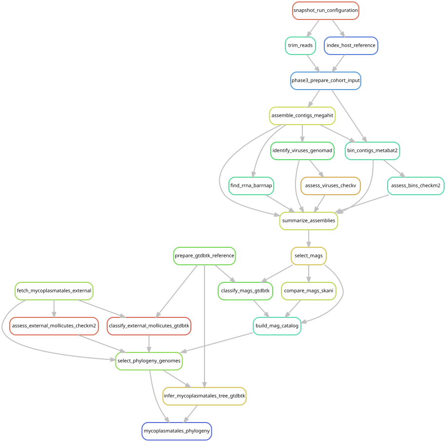

# Place recovered Mycoplasmatales in a genome tree

[Workflow index](../README.md) · [Source rules](../../../workflow/rules/mycoplasmatales_phylogeny.smk)

Compare the recovered Mycoplasmatales genomes with public relatives and infer a
new phylogeny from 120 conserved bacterial marker proteins (bac120). This provides
evolutionary context for the focal bacterial lineages.

## Inputs and products

Inputs are the recovered MAG catalog/representatives, GTDB r220 and the frozen
[external-genome table](../../../config/mycoplasmatales_external.tsv).
[config/mycoplasmatales_phylogeny.json](../../../config/mycoplasmatales_phylogeny.json)
sets taxonomic selection, completeness and outgroup criteria.
Outputs in `data/results/mycoplasmatales_phylogeny/` include external-genome
retrieval/quality records, `tree_genomes/`, `tree_labels.tsv`,
`mycoplasmatales.bac120.msa.fasta.gz` and the `.decorated.tree` file.

## Steps and rules

1. `fetch_mycoplasmatales_external` retrieves the fixed NCBI genome list and checks
   download identities.
2. `assess_external_mollicutes_checkm2` estimates genome quality;
   `classify_external_mollicutes_gtdbtk` checks GTDB taxonomy.
3. `select_phylogeny_genomes` selects eligible genomes and labels while preserving
   their source and recovered species-cluster identities.
4. `infer_mycoplasmatales_tree_gtdbtk` runs the de novo bac120 alignment/tree workflow
   with the configured GTDB taxon filter and outgroup.
5. `mycoplasmatales_phylogeny` requests the tree and labels.

## Interpretation and handoff

The tree places genomes; a short 16S marker match in another dataset supplies a
different kind of evidence. Host metadata identify the source of a public genome,
not proof of a restricted host range. See
[the comparative-context report](../../mycoplasmatales_context_results.md).

[Gene-content analysis](../mycoplasmatales_gene_content/README.md) reuses selected
genomes and labels; [publication plotting](../publication_figures/README.md) uses
the completed tree. Gene-content rules do not require tree inference itself, so
that edge should not be inferred merely from the scientific narrative.
The graph includes recovered-genome construction and the GTDB reference view.

## Preview, launch and rule graph

Run from the repository root after the [shared environment setup](../README.md#environment-and-inputs).
The preview evaluates dependencies without executing analysis jobs. The launch
command submits the same scope through the existing cluster controller.
This scope can build missing upstream products; it is not restricted to this one rule file.

```bash
# Preview only.
snakemake mycoplasmatales_phylogeny \
  --snakefile Snakefile --configfile config/config.yaml \
  --cores 1 --dry-run --rerun-triggers mtime

# Execute this scope on the cluster (not needed to view or regenerate graphs).
bash scripts/submit_workflow.sh mycoplasmatales_phylogeny config/config.yaml
```



Generated by Snakemake from `Snakefile`, `config/config.yaml`, targets `mycoplasmatales_phylogeny`.
All declared upstream rules needed by these targets are included.
Repeated jobs collapse to one node per rule; arrows point from producers to consumers.
See [graph limits and freshness checks](../README.md#regenerate-and-check-the-graphs).

```bash
# Documentation only; never executes analysis rules.
./scripts/update_rulegraphs.py phylogeny
./scripts/update_rulegraphs.py phylogeny --check
```
