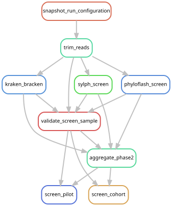

# Validate and pool the universal screens

[Workflow index](../README.md) · [Source rules](../../../workflow/rules/phase2.smk)

Combine the three broad screens into a library-quality table and a candidate
nomination table, first for the resource pilot and then for the full cohort.
These pooled suggestions organize later discovery; they are not presence grades.

## Inputs and products

Inputs are trimmed-pair quality records, Kraken/Bracken tables, sylph profiles,
phyloFlash archives and provenance from [the screen stage](../screens/README.md).
The eight pilot IDs are in [config/config.yaml](../../../config/config.yaml);
all included IDs come from [config/samples.tsv](../../../config/samples.tsv).

| Rule | Purpose | Main outputs under `data/results/` |
| --- | --- | --- |
| `validate_screen_sample` | Check paired-read accounting and all screen products for each library | `validation/screens/{sample}.json` |
| `aggregate_phase2` | Combine quality measures and nominations for the selected scope | `aggregation/{pilot,cohort}/library_qc.tsv`, `candidate_nominations.tsv` |
| `screen_pilot` | Validate the pilot aggregation and expected membership | `stages/screen_pilot.done` |
| `screen_cohort` | Validate the 205-library aggregation and expected membership | `stages/screen_cohort.done` |

## Interpretation and handoff

The pilot and cohort use identical per-library methods, and shared libraries reuse
their products. The documented command selects both terminal targets so the graph
covers every rule in this file. For a staged new execution the operational route
runs the pilot first, checks its resource gate, then requests `screen_cohort`;
see [WORKFLOW.md](../../../WORKFLOW.md#phase-2-gate).

The [assembly benchmark](../phase3/README.md) consumes the accepted screen stage.
The [reference-catalog stage](../phase4_catalog/README.md) reads the frozen cohort
nominations by a checksum-checked path supplied as a parameter; that particular
handoff is therefore absent from its Snakemake dependency graph. Keep nominations,
competitive mapping and accepted detection grades distinct when auditing results.

## Preview, launch and rule graph

Run from the repository root after the [shared environment setup](../README.md#environment-and-inputs).
The preview evaluates dependencies without executing analysis jobs. The launch
command submits the same scope through the existing cluster controller.
This scope can build missing upstream products; it is not restricted to this one rule file.

```bash
# Preview only.
snakemake screen_pilot screen_cohort \
  --snakefile Snakefile --configfile config/config.yaml \
  --cores 1 --dry-run --rerun-triggers mtime

# Execute this scope on the cluster (not needed to view or regenerate graphs).
bash scripts/submit_workflow.sh 'screen_pilot screen_cohort' config/config.yaml
```



Generated by Snakemake from `Snakefile`, `config/config.yaml`, targets `screen_pilot screen_cohort`.
All declared upstream rules needed by these targets are included.
Repeated jobs collapse to one node per rule; arrows point from producers to consumers.
See [graph limits and freshness checks](../README.md#regenerate-and-check-the-graphs).

```bash
# Documentation only; never executes analysis rules.
./scripts/update_rulegraphs.py screening
./scripts/update_rulegraphs.py screening --check
```
