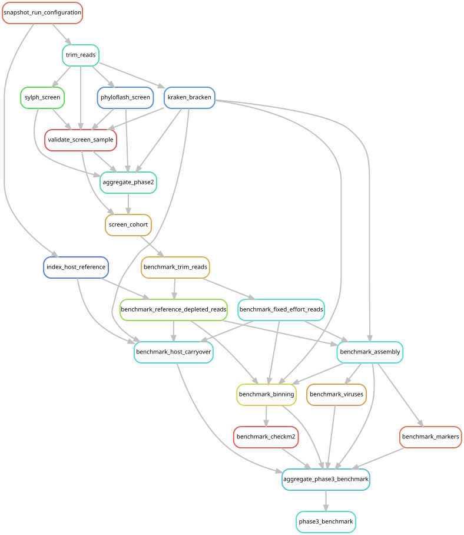

# Compare alternative inputs for microbial genome discovery

[Workflow index](../README.md) · [Source rules](../../../workflow/rules/phase3.smk)

Compare how much useful microbial sequence is recovered under different ways of
handling host-dominated reads. The frozen panel has six libraries and twelve
library–strategy combinations, spanning high/low screening signal and three
host-reference routes. This is a method benchmark, not the cohort assembly.

## Inputs and products

[config/phase3_benchmark.tsv](../../../config/phase3_benchmark.tsv) defines the
paired comparisons; [config/phase3_benchmark.json](../../../config/phase3_benchmark.json)
sets tools, databases, thresholds and resources. Inputs include the completed
cohort screen, original/selected reads and host indexes. Products are under
`data/results/phase3_benchmark/`; temporary read sets use the configured scratch
root. `decision_table.tsv` collects the evidence and
`data/results/stages/phase3_benchmark.done` records validation.

## Steps and rules

1. `benchmark_trim_reads` regenerates consistently capped/trimmed reads.
2. `benchmark_fixed_effort_reads` draws the fixed-effort input;
   `benchmark_reference_depleted_reads` removes host-mapped pairs. The
   Kraken-selected comparison uses the existing screen reads directly.
3. `benchmark_assembly` assembles each panel row with MEGAHIT.
4. `benchmark_markers` detects rRNA; `benchmark_viruses` detects viral sequence;
   `benchmark_binning` bins contigs using mapped coverage; `benchmark_checkm2`
   assesses genome completeness and contamination.
5. `benchmark_host_carryover` measures residual host mapping where a reference exists.
6. `aggregate_phase3_benchmark` combines biological recovery and resource metrics;
   `phase3_benchmark` checks the resulting table against the panel.

## Interpretation and handoff

The accepted decision was reference depletion for hosts with an audited reference
and a deterministic 25-million-pair trimmed-read subset for reference-free hosts.
See [the execution record](../../../RUNLOG.md) and
[cohort input preparation](../phase3_cohort/README.md). This benchmark does not
measure every possible source of catalog discovery bias. Downstream mapping to a
fixed catalog addresses a separate question from recovering new genomes.

The graph includes dependencies in earlier rule files. The benchmark's decision
is transferred into cohort configuration by a reviewed scientific decision;
Snakemake does not automatically derive that configuration from `decision_table.tsv`.

## Preview, launch and rule graph

Run from the repository root after the [shared environment setup](../README.md#environment-and-inputs).
The preview evaluates dependencies without executing analysis jobs. The launch
command submits the same scope through the existing cluster controller.
This scope can build missing upstream products; it is not restricted to this one rule file.

```bash
# Preview only.
snakemake phase3_benchmark \
  --snakefile Snakefile --configfile config/config.yaml \
  --cores 1 --dry-run --rerun-triggers mtime

# Execute this scope on the cluster (not needed to view or regenerate graphs).
bash scripts/submit_workflow.sh phase3_benchmark config/config.yaml
```



Generated by Snakemake from `Snakefile`, `config/config.yaml`, targets `phase3_benchmark`.
All declared upstream rules needed by these targets are included.
Repeated jobs collapse to one node per rule; arrows point from producers to consumers.
See [graph limits and freshness checks](../README.md#regenerate-and-check-the-graphs).

```bash
# Documentation only; never executes analysis rules.
./scripts/update_rulegraphs.py benchmark
./scripts/update_rulegraphs.py benchmark --check
```
