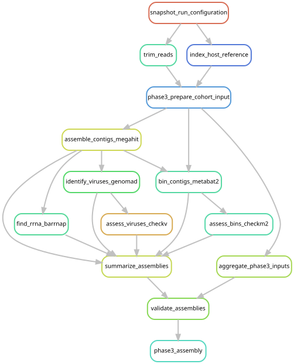

# Assemble eligible libraries and recover candidate genomes

[Workflow index](../README.md) · [Source rules](../../../workflow/rules/phase3_assembly.smk)

Turn each eligible library's prepared reads into longer sequences, ribosomal
markers, candidate viral sequences and metagenome-assembled genome (MAG) bins.
A bin is a group of contigs inferred to belong to one microbial genome.

## Inputs and products

The accepted reads come from [cohort input preparation](../phase3_cohort/README.md).
[config/phase3_assembly.tsv](../../../config/phase3_assembly.tsv) fixes membership;
[config/phase3_assembly.json](../../../config/phase3_assembly.json) sets tools and
resources. Per-library products are in `data/results/phase3_cohort/` under
`assemblies/`, `markers/`, `viruses/`, `checkv/`, `bins/` and `checkm2/`.
`assembly_summary.tsv` retains included libraries and recorded exclusions.

## Steps and rules

1. `assemble_contigs_megahit` assembles prepared pairs and prefixes contig IDs with
   their source-library ID.
2. `find_rrna_barrnap` finds bacterial, archaeal and eukaryotic ribosomal genes.
3. `identify_viruses_genomad` identifies viral candidates;
   `assess_viruses_checkv` assesses completeness and contamination.
4. `bin_contigs_metabat2` maps reads back to contigs, estimates coverage and bins
   contigs; `assess_bins_checkm2` estimates bin quality.
5. `summarize_assemblies` tabulates the cohort; `validate_assemblies` checks the
   frozen membership and eligibility. `phase3_assembly` requests that validation.

## Interpretation and handoff

No bins, no viral candidates and no assessable CheckM2 annotations are distinct
recorded states. A successful assembly job need not recover a microbial genome.
These products are discovery evidence and do not measure organism abundance.

[Recovered catalogs](../phase3_catalog/README.md) apply quality and clustering
criteria. [Phase 6](../phase6_analysis/README.md) uses same-library contig matches
as assembly support; the [eukaryote gate](../eukaryote_gate/README.md) uses recovered
ribosomal genes. The graph includes input preparation and the eligibility table,
while the earlier manual membership freeze is represented as an external input.

## Preview, launch and rule graph

Run from the repository root after the [shared environment setup](../README.md#environment-and-inputs).
The preview evaluates dependencies without executing analysis jobs. The launch
command submits the same scope through the existing cluster controller.
This scope can build missing upstream products; it is not restricted to this one rule file.

```bash
# Preview only.
snakemake phase3_assembly \
  --snakefile Snakefile --configfile config/config.yaml \
  --cores 1 --dry-run --rerun-triggers mtime

# Execute this scope on the cluster (not needed to view or regenerate graphs).
bash scripts/submit_workflow.sh phase3_assembly config/config.yaml
```



Generated by Snakemake from `Snakefile`, `config/config.yaml`, targets `phase3_assembly`.
All declared upstream rules needed by these targets are included.
Repeated jobs collapse to one node per rule; arrows point from producers to consumers.
See [graph limits and freshness checks](../README.md#regenerate-and-check-the-graphs).

```bash
# Documentation only; never executes analysis rules.
./scripts/update_rulegraphs.py assembly
./scripts/update_rulegraphs.py assembly --check
```
