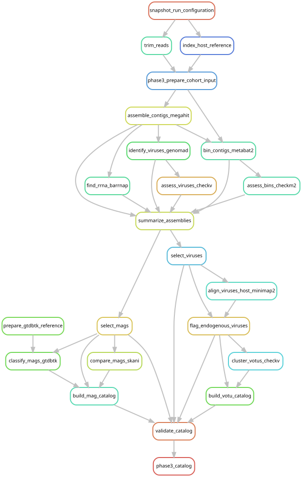

# Build species and viral catalogs from recovered sequences

[Workflow index](../README.md) · [Source rules](../../../workflow/rules/phase3_catalog.smk)

Select usable microbial genomes and viruses from the per-library assemblies, then
cluster similar sequences so cohort mapping does not count redundant genomes as
separate species. Preserve source-library identities and separate possible
host-integrated viral sequences from candidate associate viruses.

## Inputs and products

Inputs are the frozen assembly membership and per-library assembly summaries,
bins, quality reports and viral sequences. Parameters are in
[config/phase3_catalog.json](../../../config/phase3_catalog.json), with rationale in
[the quality decision record](../../phase3_qc_decisions.md).
Main products are `data/results/phase3_catalog/mags/mag_catalog.tsv`, its
`species_representatives/` directory, and `votus/{associate,endogenous_candidate}`
catalog tables/representative FASTAs. A vOTU is a cluster of related viral sequences.

## Steps and rules

1. `select_mags` selects assessed bins with at least 50% completeness and less than
   10% contamination. `prepare_gtdbtk_reference` creates the corrected local
   reference-directory view; `classify_mags_gtdbtk` assigns GTDB r220 taxonomy.
2. `compare_mags_skani` estimates average nucleotide identity (ANI);
   `build_mag_catalog` retains prokaryotic genomes and clusters at 95% ANI with
   at least 50% of at least one genome aligned. It chooses representatives using
   completeness minus five times contamination.
3. `select_viruses` requires a viral hallmark plus the configured length or
   completeness criterion. `align_viruses_host_minimap2` and
   `flag_endogenous_viruses` identify candidate host-associated integrations.
4. `cluster_votus_checkv` clusters the two viral classes separately at 95% ANI
   over at least 85% of the shorter sequence; `build_votu_catalog` records membership.
5. `validate_catalog` checks the locked criteria; `phase3_catalog` requests it.

## Interpretation and handoff

[Phase 4](../phase4_catalog/README.md) combines these discoveries with public
references. Closely related genomes, incomplete bins and candidate endogenous
viruses have different interpretation limits; consult the decision record.
Selection scripts also read per-library products through a results-directory
parameter, so not every consumed bin or quality file is an explicit graph edge.
The graph depicts declared dependencies, including assembly summaries, rather
than a complete inventory of every file opened by those scripts.

## Preview, launch and rule graph

Run from the repository root after the [shared environment setup](../README.md#environment-and-inputs).
The preview evaluates dependencies without executing analysis jobs. The launch
command submits the same scope through the existing cluster controller.
This scope can build missing upstream products; it is not restricted to this one rule file.

```bash
# Preview only.
snakemake phase3_catalog \
  --snakefile Snakefile --configfile config/config.yaml \
  --cores 1 --dry-run --rerun-triggers mtime

# Execute this scope on the cluster (not needed to view or regenerate graphs).
bash scripts/submit_workflow.sh phase3_catalog config/config.yaml
```



Generated by Snakemake from `Snakefile`, `config/config.yaml`, targets `phase3_catalog`.
All declared upstream rules needed by these targets are included.
Repeated jobs collapse to one node per rule; arrows point from producers to consumers.
See [graph limits and freshness checks](../README.md#regenerate-and-check-the-graphs).

```bash
# Documentation only; never executes analysis rules.
./scripts/update_rulegraphs.py recovered_catalog
./scripts/update_rulegraphs.py recovered_catalog --check
```
