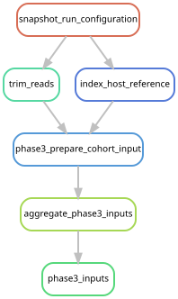

# Prepare accepted assembly inputs and determine eligibility

[Workflow index](../README.md) · [Source rules](../../../workflow/rules/phase3_cohort.smk)

Apply the selected input strategy to every included library, then record whether
enough pairs remain for assembly. Libraries below the assembly floor remain in
screening, mapping and descriptive analyses.

## Inputs and products

Inputs are trimmed reads, trim provenance and the appropriate host indexes.
[config/phase3_cohort.json](../../../config/phase3_cohort.json) selects the strategy,
fixed-effort seed and 175,000-pair minimum. Products under
`data/results/phase3_cohort/` are `inputs/{sample}_R[12].fastq.gz`, per-library yield
JSON files, and `input_eligibility.tsv`. The validation marker is
`data/results/stages/phase3_inputs.done`.

## Steps and rules

1. `phase3_prepare_cohort_input` removes pairs mapping to the Physalia/Nanomia
   reference when available; otherwise it draws at most 25 million pairs from
   the full quality-filtered library with a fixed seed.
2. `aggregate_phase3_inputs` combines yields and applies the assembly floor.
3. `phase3_inputs` validates cohort membership, routes and eligibility accounting.

## Interpretation and handoff

The accepted eligibility table is frozen separately into
[config/phase3_assembly.tsv](../../../config/phase3_assembly.tsv) using
[scripts/freeze_phase3_assembly.py](../../../scripts/freeze_phase3_assembly.py).
That reviewed freeze is outside the rule graph; assembly reads the frozen table.
See [cohort assembly](../phase3_assembly/README.md).

The 25-million-pair subset affects genome discovery in reference-free hosts.
[Phase 5 mapping](../phase5_mapping/README.md) instead uses their full trimmed
libraries after the earlier 200-million-pair cap. The same host-depleted pairs
are used for assembly and mapping in reference-bearing libraries. A lack of a
recovered genome is therefore not evidence that an organism was absent.

The graph shows the complete declared route to input eligibility, including
trimming and reference indexing. Benchmark acceptance is a configuration decision,
not a dependency that automatically reruns the benchmark.

## Preview, launch and rule graph

Run from the repository root after the [shared environment setup](../README.md#environment-and-inputs).
The preview evaluates dependencies without executing analysis jobs. The launch
command submits the same scope through the existing cluster controller.
This scope can build missing upstream products; it is not restricted to this one rule file.

```bash
# Preview only.
snakemake phase3_inputs \
  --snakefile Snakefile --configfile config/config.yaml \
  --cores 1 --dry-run --rerun-triggers mtime

# Execute this scope on the cluster (not needed to view or regenerate graphs).
bash scripts/submit_workflow.sh phase3_inputs config/config.yaml
```



Generated by Snakemake from `Snakefile`, `config/config.yaml`, targets `phase3_inputs`.
All declared upstream rules needed by these targets are included.
Repeated jobs collapse to one node per rule; arrows point from producers to consumers.
See [graph limits and freshness checks](../README.md#regenerate-and-check-the-graphs).

```bash
# Documentation only; never executes analysis rules.
./scripts/update_rulegraphs.py inputs
./scripts/update_rulegraphs.py inputs --check
```
