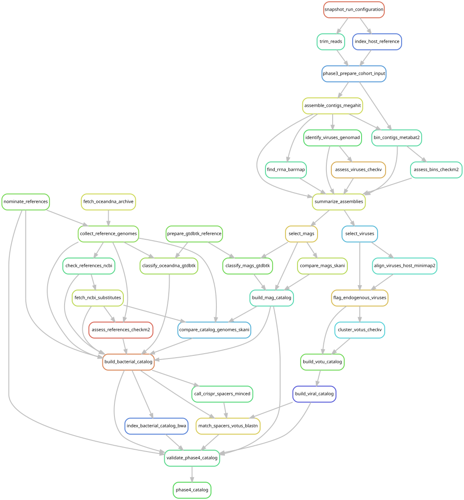

# Combine recovered and public genomes into mapping catalogs

[Workflow index](../README.md) · [Source rules](../../../workflow/rules/phase4_catalog.smk)

Build the shared reference set against which every library is tested. Combine
recovered MAG species with independently nominated public genomes, remove
redundancy, retain negative-control decoys, and prepare viral and CRISPR references.
CRISPR spacers are short bacterial sequences that can suggest past virus–host links.

## Inputs and products

[config/phase4_catalog.json](../../../config/phase4_catalog.json) selects catalog
version **v2** and the reference/quality rules; the opening v1 wording in the
existing rule-file comment is historical. Evidence and corrections are in
[the catalog decision record](../../phase4_catalog_decisions.md).
Inputs include the frozen screen nominations, recovered catalogs, GTDB/OceanDNA
reference genomes and NCBI metadata. Outputs under `data/results/phase4_catalog/`
include reference audit tables and `v2/bacterial_catalog.{fna,manifest.tsv}`, BWA
indexes, both viral-class FASTAs/manifests and `v2/crispr/host_links.tsv`.

## Steps and rules

1. `nominate_references` takes qualifying sylph nominations (at least 95% adjusted
   ANI) and selects decoy candidates; `fetch_oceandna_archive` and
   `collect_reference_genomes` obtain/stage the genomes.
2. `check_references_ncbi` checks current records; `fetch_ncbi_substitutes` retrieves
   replacements; `assess_references_checkm2` and `classify_oceandna_gtdbtk` assess
   quality and taxonomy.
3. `compare_catalog_genomes_skani` compares all sources; `build_bacterial_catalog`
   pools and clusters genomes; `index_bacterial_catalog_bwa` indexes the result.
4. `build_viral_catalog` freezes associate and endogenous-candidate vOTUs.
5. `call_crispr_spacers_minced` finds spacers; `match_spacers_votus_blastn` matches
   them to viruses and records candidate host links.
6. `validate_phase4_catalog` checks the outputs; `phase4_catalog` requests it.

## Interpretation and handoff

[Phase 5](../phase5_mapping/README.md) maps every library against this shared set.
The catalog includes discovered genomes and available nominated references; it
cannot test an unknown organism absent from both sources. CRISPR links are host
predictions, not direct infection observations.

The frozen cohort nomination table is passed as a checksum-verified parameter,
not an `input:` dependency. The GTDB genome directory is also supplied through a
parameter. Their upstream production is absent from the graph. External retrieval
rules appear as nodes, but graph generation does not contact those services.

## Preview, launch and rule graph

Run from the repository root after the [shared environment setup](../README.md#environment-and-inputs).
The preview evaluates dependencies without executing analysis jobs. The launch
command submits the same scope through the existing cluster controller.
This scope can build missing upstream products; it is not restricted to this one rule file.

```bash
# Preview only.
snakemake phase4_catalog \
  --snakefile Snakefile --configfile config/config.yaml \
  --cores 1 --dry-run --rerun-triggers mtime

# Execute this scope on the cluster (not needed to view or regenerate graphs).
bash scripts/submit_workflow.sh phase4_catalog config/config.yaml
```



Generated by Snakemake from `Snakefile`, `config/config.yaml`, targets `phase4_catalog`.
All declared upstream rules needed by these targets are included.
Repeated jobs collapse to one node per rule; arrows point from producers to consumers.
See [graph limits and freshness checks](../README.md#regenerate-and-check-the-graphs).

```bash
# Documentation only; never executes analysis rules.
./scripts/update_rulegraphs.py mapping_catalog
./scripts/update_rulegraphs.py mapping_catalog --check
```
