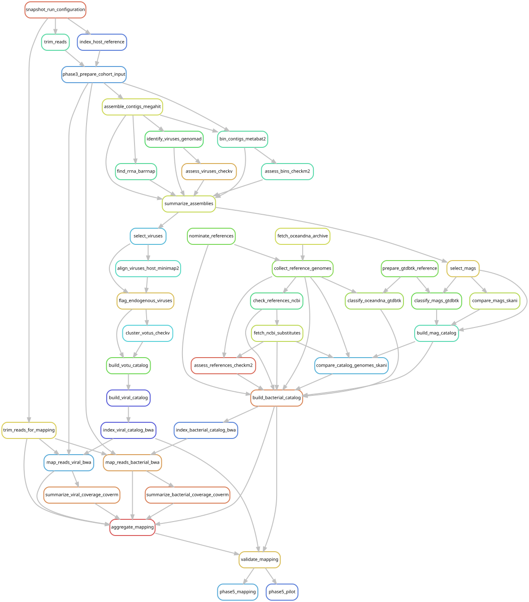

# Map every library against the common microbial catalogs

[Workflow index](../README.md) · [Source rules](../../../workflow/rules/phase5_mapping.smk)

Test all included libraries against the same bacterial/archaeal and viral targets,
including genomes recovered from other host species. Competitive mapping lets
similar catalog sequences compete for reads. Genome discovery and detection in
another library are separate steps.

## Inputs and products

Inputs are the v2 [mapping catalogs](../phase4_catalog/README.md) and read pairs
selected by `phase5_reads` in [common.smk](../common/README.md).
[config/phase5_mapping.json](../../../config/phase5_mapping.json) locks filters.
Per-library BAM alignments, coverage and cohort tables live in
`data/results/phase5_mapping/v2/`; the main audit tables are
`cohort/{bacterial_coverage,viral_coverage,library_mapping}.tsv`.

## Steps and rules

1. `trim_reads_for_mapping` regenerates the full quality-filtered reference-free
   libraries using the original cap and trimming implementation. Referenced hosts
   use the retained host-depleted pairs from Phase 3.
2. `index_viral_catalog_bwa` combines both viral classes into one competitive index.
3. `map_reads_bacterial_bwa` and `map_reads_viral_bwa` use BWA, retain primary proper
   pairs with MAPQ at least 30 and remove duplicates.
4. `summarize_bacterial_coverage_coverm` and `summarize_viral_coverage_coverm` require
   at least 95% read identity over at least 75% of each read, then report covered
   fraction (breadth), depth and other configured measures.
5. `aggregate_mapping` combines outputs and read accounting; `validate_mapping`
   checks membership and accounting. `phase5_pilot` and `phase5_mapping` request
   the pilot and cohort validations respectively.

## Interpretation and handoff

All 205 libraries are evaluated, including libraries below the assembly floor.
Reference-free mapping uses full capped trimmed reads, not the 25-million-pair
assembly subset. Detection does not require a genome assembled from that library.
[Phase 6](../phase6_analysis/README.md) turns continuous coverage into graded evidence.

The graph shows both pilot and cohort targets, which reuse shared per-library
products. Some accounting inputs (`input_eligibility.tsv`, the sample table and
cohort library QC) are passed to scripts as parameters, so those reads are not
all explicit dependency edges. Original completion/quality evidence remains in
[the presence decision record](../../phase5_presence_decisions.md).

## Preview, launch and rule graph

Run from the repository root after the [shared environment setup](../README.md#environment-and-inputs).
The preview evaluates dependencies without executing analysis jobs. The launch
command submits the same scope through the existing cluster controller.
This scope can build missing upstream products; it is not restricted to this one rule file.

```bash
# Preview only.
snakemake phase5_pilot phase5_mapping \
  --snakefile Snakefile --configfile config/config.yaml \
  --cores 1 --dry-run --rerun-triggers mtime

# Execute this scope on the cluster (not needed to view or regenerate graphs).
bash scripts/submit_workflow.sh 'phase5_pilot phase5_mapping' config/config.yaml
```



Generated by Snakemake from `Snakefile`, `config/config.yaml`, targets `phase5_pilot phase5_mapping`.
All declared upstream rules needed by these targets are included.
Repeated jobs collapse to one node per rule; arrows point from producers to consumers.
See [graph limits and freshness checks](../README.md#regenerate-and-check-the-graphs).

```bash
# Documentation only; never executes analysis rules.
./scripts/update_rulegraphs.py mapping
./scripts/update_rulegraphs.py mapping --check
```
