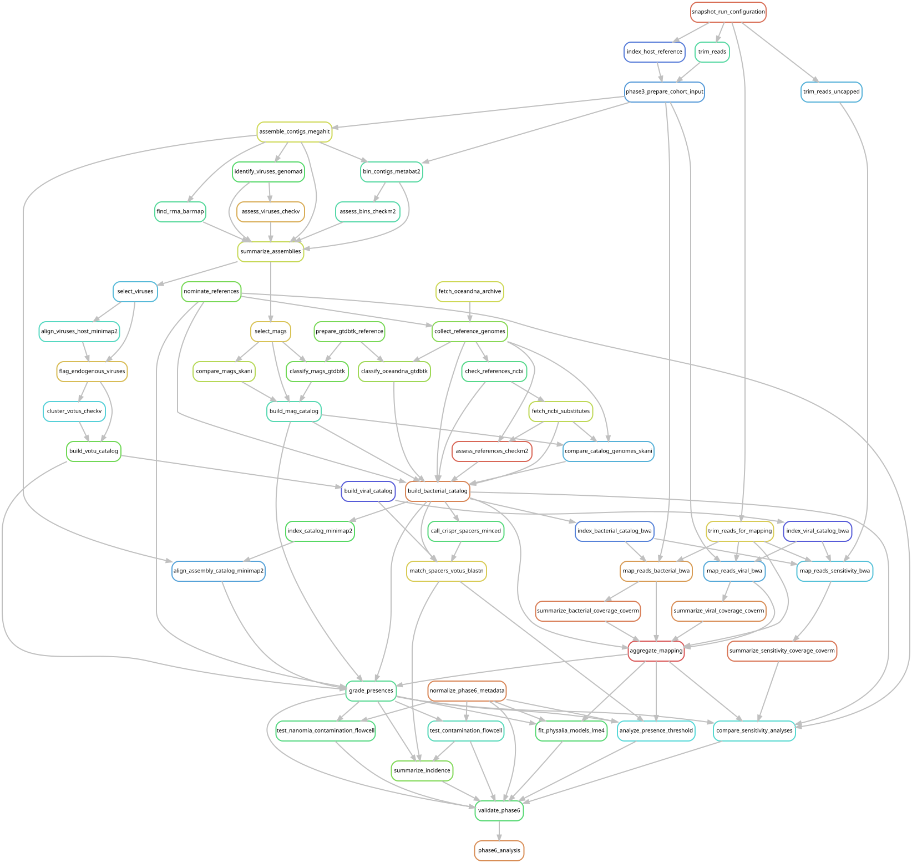

# Grade detections and test distributions and sensitivity

[Workflow index](../README.md) · [Source rules](../../../workflow/rules/phase6_analysis.smk)

Combine competitive read mapping with assembly evidence, summarize associate
incidence, test geographic/batch patterns, and assess sensitivity to thresholds
and read handling. A detection grade describes sequence evidence, not symbiosis,
infection, viability or host specificity.

## Inputs and products

Inputs are Phase 5 v2 coverage tables, the common catalogs, source metadata,
cohort assemblies and the frozen sensitivity subsets.
[config/phase5_presence.json](../../../config/phase5_presence.json) specifies
presence thresholds; [config/phase6_analysis.json](../../../config/phase6_analysis.json)
and [the analysis plan](../../phase6_analysis_plan.md) define inference.
Products in `data/results/phase6_analysis/v2/` include `grades/`, `primary/`,
`assembly_support/` and `sensitivity/`. The older `catalog_version: v1` metadata
in the presence-threshold file does not select output paths; Phase 5 configuration
selects v2, and the threshold values are reused.

## Steps and rules

1. `index_catalog_minimap2` and `align_assembly_catalog_minimap2` measure
   same-library contig support for catalog genomes.
2. `trim_reads_uncapped`, `map_reads_sensitivity_bwa` and
   `summarize_sensitivity_coverage_coverm` generate the specified control mappings.
3. `grade_presences` applies the locked grades; `normalize_phase6_metadata` records
   physical flowcells. `test_contamination_flowcell` and
   `test_nanomia_contamination_flowcell` assess concentration by sequencing batch.
4. `summarize_incidence` produces bacterial/viral summaries and phage-host links.
   `fit_physalia_models_lme4` fits the specified models and the approved
   within-flowcell region permutation test.
5. `analyze_presence_threshold` repeats inference at 5% and 20% breadth;
   `compare_sensitivity_analyses` summarizes read-handling and study sensitivity.
6. `validate_phase6` checks outputs; `phase6_analysis` requests all these branches.

## Interpretation and handoff

Bacterial validation requires at least 10% breadth and 100 mapped reads; assembly
support raises the evidence grade. High-confidence support can come from the
source MAG or at least 10,000 aligned catalog bases at 95% identity. Viral presence
uses at least 75% breadth, with source-assembly support tracked separately.

Descriptive summaries retain all 205 libraries. Flowcell inference uses the
single-physical-flowcell subset, including 122 Physalia libraries. Failed or
singular mixed-model fits are not valid significant results; the approved
permutation analysis and its stated limits are the inferential evidence.
Host-handling controls map to a fixed catalog and do not measure discovery of
microbes absent from it. The full target includes control mapping, so it is broader
than a statistics-only rerun. [Publication exports](../publication_figures/README.md)
consume the graded and summarized results.

## Preview, launch and rule graph

Run from the repository root after the [shared environment setup](../README.md#environment-and-inputs).
The preview evaluates dependencies without executing analysis jobs. The launch
command submits the same scope through the existing cluster controller.
This scope can build missing upstream products; it is not restricted to this one rule file.

```bash
# Preview only.
snakemake phase6_analysis \
  --snakefile Snakefile --configfile config/config.yaml \
  --cores 1 --dry-run --rerun-triggers mtime

# Execute this scope on the cluster (not needed to view or regenerate graphs).
bash scripts/submit_workflow.sh phase6_analysis config/config.yaml
```



Generated by Snakemake from `Snakefile`, `config/config.yaml`, targets `phase6_analysis`.
All declared upstream rules needed by these targets are included.
Repeated jobs collapse to one node per rule; arrows point from producers to consumers.
See [graph limits and freshness checks](../README.md#regenerate-and-check-the-graphs).

```bash
# Documentation only; never executes analysis rules.
./scripts/update_rulegraphs.py analysis
./scripts/update_rulegraphs.py analysis --check
```
