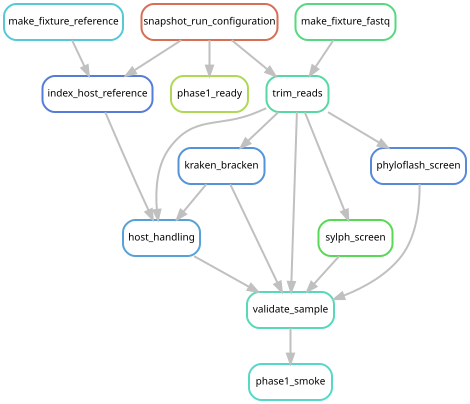

# Prepare paired sequencing reads

[Workflow index](../README.md) · [Source rules](../../../workflow/rules/preprocess.smk)

Combine each library's original paired FASTQ files, limit exceptionally large
libraries to the locked read budget, and remove low-quality sequence and adapters.
These reads feed all three broad screens and the later host-handling routes.

## Inputs and products

Inputs are the selected FASTQ paths and pair counts in
[config/samples.tsv](../../../config/samples.tsv), plus the saved run configuration.
Settings are in [config/config.yaml](../../../config/config.yaml).
Production trimmed mates are `{scratch_root}/trimmed/{sample}_R[12].fastq.gz`;
quality summaries persist in `data/results/trim/`, and command/input records in
`data/results/provenance/trim/`.

## Steps and rules

1. `make_fixture_fastq` creates a deterministic 50,000-pair test dataset from a
   real library when fixture mode is enabled. It also records which input was used.
2. `trim_reads` uses the shared
   [trimming implementation](../../../workflow/scripts/trim_reads.py): a seeded
   200-million-pair cap when required, then fastp adapter/quality processing.
   The cap seed is 20260829. HTML and JSON reports accompany the retained pairs.

Production trimmed FASTQs are temporary and may be removed after their consumers
finish. Their absence does not mean the persistent screen results failed.
Later mapping can regenerate trimmed reads with the same implementation.
The cap and the separate 25-million-pair assembly subset are different operations;
see [cohort input preparation](../phase3_cohort/README.md).

## Handoff and graph scope

[Screen rules](../screens/README.md) consume the trimmed mates. Host mapping and
assembly input preparation also use them. The graph below is the three-library
fixture, covering all preprocessing rules and both referenced host routes plus
the reference-free route. It includes adjacent stages so their dependencies are
visible; its tiny reference excerpts are only for testing. The production
[screening graph](../phase2/README.md) omits fixture generation and spans the cohort.

## Preview, launch and rule graph

Run from the repository root after the [shared environment setup](../README.md#environment-and-inputs).
The preview evaluates dependencies without executing analysis jobs. The launch
command submits the same scope through the existing cluster controller.
This scope can build missing upstream products; it is not restricted to this one rule file.

```bash
# Preview only.
snakemake phase1_ready phase1_smoke \
  --snakefile Snakefile --configfile tests/config.fixture.yaml \
  --cores 1 --dry-run --rerun-triggers mtime

# Execute this scope on the cluster (not needed to view or regenerate graphs).
bash scripts/submit_workflow.sh 'phase1_ready phase1_smoke' tests/config.fixture.yaml
```



Generated by Snakemake from `Snakefile`, `tests/config.fixture.yaml`, targets `phase1_ready phase1_smoke`.
All declared upstream rules needed by these targets are included.
Repeated jobs collapse to one node per rule; arrows point from producers to consumers.
See [graph limits and freshness checks](../README.md#regenerate-and-check-the-graphs).

```bash
# Documentation only; never executes analysis rules.
./scripts/update_rulegraphs.py smoke
./scripts/update_rulegraphs.py smoke --check
```
