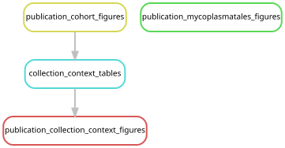

# Export publication figures and collection-context tables

[Workflow index](../README.md) · [Source rules](../../../workflow/rules/publication_figures.smk)

Create compact figures and their source tables from accepted biological results.
The documented graph is deliberately restricted to the four reporting rules in
this file. It consumes completed upstream files and cannot schedule sequence
processing, mapping or statistical inference.

## Inputs and products

Inputs are accepted v2 bacterial/viral grades, eukaryote grades, flowcell metadata,
the manifest, catalog tables, and the completed Mycoplasmatales tree/gene summaries.
The [figure guide](../../../figures/README.md) records export formats, source tables
and provenance. Outputs are in `figures/cohort/`, `figures/mycoplasmatales/` and
`figures/collection_context/`.

| Rule | Purpose | Principal outputs |
| --- | --- | --- |
| `publication_cohort_figures` | Export sampling, evidence and detection tables from accepted grades | Cohort PDFs, detection TSVs, `summary.json`, source checksums |
| `publication_mycoplasmatales_figures` | Draw the focused tree and predicted functions | `phylogeny_focus.pdf`, `gene_functions.pdf`, `manifest.json` |
| `collection_context_tables` | Join collection metadata to detections; summarize depth, tissue and geography | `library_context.tsv`, DT-68 tables, regional/tissue summaries and provenance |
| `publication_collection_context_figures` | Plot the collection-context summaries | Depth/host, DT-68 and tissue PDFs/PNGs with a plotting manifest |

## Interpretation and handoff

All libraries remain in descriptive denominators; inferential subsets are flagged
separately. Assigned surface depths are distinguished from measured source depths.
The California–Washington comparison does not isolate a depth effect, and tissue
comparisons do not measure bacterial concentration or anatomical location.
See [collection-context interpretation](../../collection_context_analysis.md).

Some plotting scripts read additional accepted tables through their own fixed
paths, beyond the files declared in the rules. Their provenance manifests identify
actual consumed inputs. Small reviewed assets are copied to the separate manuscript
repository; the manuscript is not built by these rules.

The newer broad overview figures are made by
[figures/plot_associate_overview.py](../../../figures/plot_associate_overview.py),
which is **not** a rule in this file. Its outputs and explicit command are in
[the figure guide](../../../figures/README.md#biological-overview-figures).
The direct Waki marker analysis is also outside this graph. The existing
[two-rule collection-context graph](../../../figures/collection_context/rulegraph.svg)
is a narrower historical reporting view; the graph below covers all four rules.

## Preview, launch and rule graph

Run from the repository root after the [shared environment setup](../README.md#environment-and-inputs).
The preview evaluates dependencies without executing analysis jobs. The launch
command submits the same scope through the existing cluster controller.
Only the listed reporting rules are permitted; missing upstream products cause an error.

```bash
# Preview only.
snakemake publication_cohort_figures publication_mycoplasmatales_figures publication_collection_context_figures \
  --snakefile Snakefile --configfile config/config.yaml \
  --cores 1 --dry-run --rerun-triggers mtime \
  --allowed-rules publication_cohort_figures publication_mycoplasmatales_figures collection_context_tables publication_collection_context_figures

# Execute this scope on the cluster (not needed to view or regenerate graphs).
bash scripts/submit_workflow.sh 'publication_cohort_figures publication_mycoplasmatales_figures publication_collection_context_figures' config/config.yaml \
  'publication_cohort_figures publication_mycoplasmatales_figures collection_context_tables publication_collection_context_figures'
```



Generated by Snakemake from `Snakefile`, `config/config.yaml`, targets `publication_cohort_figures publication_mycoplasmatales_figures publication_collection_context_figures`.
The explicit allowed-rule list above bounds this graph.
Repeated jobs collapse to one node per rule; arrows point from producers to consumers.
See [graph limits and freshness checks](../README.md#regenerate-and-check-the-graphs).

```bash
# Documentation only; never executes analysis rules.
./scripts/update_rulegraphs.py publication
./scripts/update_rulegraphs.py publication --check
```
