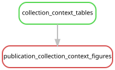

# Publication figures

Figures are generated here from the analysis repository's accepted results.
Keep scripts, source tables and provenance together; copy selected small PDF
exports to the manuscript repository with its `scripts/sync_assets.py` helper.
The manuscript TeX build does not read from this repository.

## Builds

The bounded downstream correction/figure workflow can be submitted through
the existing persistent SLURM controller:

```bash
bash scripts/submit_review_corrections.sh
```

Inside an existing compute allocation (at least one CPU and 5 GB), run:

```bash
bash scripts/run_review_corrections.sh --dry-run
bash scripts/run_review_corrections.sh
```

These entry points whitelist downstream statistics, eukaryote reporting and
publication figure rules. Existing assembly and mapping products are inputs;
missing upstream files cause failure rather than sequence reanalysis.
On 2026-10-03, the workflow ran inside allocation 11793267 on r209u08n04,
using one CPU and a 4-GB workflow memory budget. Source base revision was
`0a7c3e85a0e8f4856a16e5fc75e6a0ec73ba7b19`, with review corrections preserved
as working-tree snapshots because Git metadata was read-only.

## Exports

| Export | Build script | Inputs and interpretation |
| --- | --- | --- |
| `cohort/sampling.pdf` | `build_cohort.py` | Deduplicated manifest; all 205 libraries and all 37 host labels |
| `cohort/mycoplasmatales_incidence.pdf` | `build_cohort.py` | Catalog v2 and unchanged primary grades; full descriptive denominators |
| `cohort/eukaryote_evidence.pdf` | `build_cohort.py` | Corrected eukaryote reporting; 61 nonredundant detections, not species richness |
| `mycoplasmatales/phylogeny_focus.pdf` | `../workflow/scripts/plot_mycoplasmatales_figures.py` | Existing bac120 tree and labels; branch lengths and local support preserved |
| `mycoplasmatales/gene_functions.pdf` | same | Existing KO tables; strict and relaxed-only assignments distinguished |
| `collection_context/depth_host_overview.pdf` | `plot_collection_context.py` | All 205 specimens; recorded/assigned depth, host and separate domain detection fractions |
| `collection_context/dt68_depth_context.pdf` | same | All Nanomia and Resomia, DT-68 evidence grade, depth and collection context |
| `collection_context/tissue_context.pdf` | same | Tissue denominators and within-tentacle Physalia regional descriptions |
| `overview/study_overview.pdf` | `plot_associate_overview.py` | All 205 specimens; host sampling, supported detections and study exposition, with explicit photograph placeholders |
| `overview/microbial_host_distribution.pdf` | same | Bacterial and archaeal detections across all 37 recorded host labels, with counts and full-cohort denominators |
| `overview/eukaryote_evidence.pdf` | same | The same 61 retained detections in 39 libraries, grouped and labelled by host |

PDFs are vector exports with embedded TrueType fonts. PNG files are review
previews. `cohort/source_checksums.tsv` and `cohort/source_revision.txt` identify
the inputs and plotting code. `mycoplasmatales/manifest.json` also records
runtime package versions and output checksums; its `provenance/` directory
contains the exact plotting script. The manuscript copy manifest additionally
records hashes of every copied artifact and exact dirty-source snapshots.

All libraries, including those sequenced on multiple flowcells, contribute to
descriptive exports. Only flowcell-based inference uses the explicitly
identified single-flowcell subset. The separate figure directory README records
Mycoplasmatales interpretation and visual checks.

## Collection-context descriptions

The collection-depth and tissue comparisons use accepted cohort tables and
curated metadata. See [analysis scope and interpretation](../docs/collection_context_analysis.md).
The table producer uses Python standard library only. The existing plotting
environment supplies Python 3.11.4, Matplotlib 3.7.1 and NumPy 1.24.2; provenance
records actual versions. With the existing Snakemake 7.24.0 environment on PATH,
preview this bounded target from the repository root:

```bash
XDG_CACHE_HOME=/tmp/siph-associates-snakemake-cache snakemake \
  publication_collection_context_figures --cores 1 --dry-run \
  --allowed-rules collection_context_tables publication_collection_context_figures
```

Remove `--dry-run` to execute the same target. This scope includes only the two
new lightweight producers; missing cohort inputs fail instead of triggering
upstream analyses. Their actual commands, hashes and code snapshots are in
`collection_context/provenance.json` and `collection_context/plot_manifest.json`.
The source study, host, depth, region and tissue overlap, so these are descriptive
comparisons. No new statistical tests or sequence analyses were run.



The graph is generated from the same target and allowed rules (Snakemake
7.24.0, Graphviz 2.40.1). Check its freshness from the repository root:

```bash
set -o pipefail
export XDG_CACHE_HOME=/tmp/siph-associates-snakemake-cache
export PYTHONHASHSEED=0
snakemake publication_collection_context_figures --snakefile Snakefile \
  --cores 1 --rulegraph \
  --allowed-rules collection_context_tables publication_collection_context_figures \
  | dot -Tsvg > /tmp/collection-context-rulegraph.svg
cmp figures/collection_context/rulegraph.svg /tmp/collection-context-rulegraph.svg
```

After a reviewed rule change, replace the SVG with the generated file.
Two generations were verified byte-identical; the normal dry run was up to
date and a forced dry run contained exactly the two reporting jobs. There
is no repository CI configuration; this freshness command is the local
pre-merge check.

## Biological overview figures

The four main-figure selection comprises the study overview, broad microbial
distribution, existing focused Mycoplasmatales phylogeny, and the eukaryote
matrix with host labels. The separate Mycoplasmatales incidence and gene-function
figures remain available for supplementary use. This changes figure selection
and presentation without changing the accepted evidence thresholds.

From the repository root, inside the existing compute allocation, generate the
three new overview figures with the existing plotting environment:

```bash
MPLCONFIGDIR=/tmp/siph-associates-matplotlib \
  /gpfs/gibbs/project/dunn/cwd7/conda_envs/snakemake/bin/python \
  figures/plot_associate_overview.py
```

The script consumes the accepted `cohort/sample_metadata.tsv`, bacterial,
viral and eukaryote detection tables, and the collection-context host summary.
It verifies the 205-library join, accepted grades, 61 retained eukaryotic
detections in 39 libraries, and agreement of independently collapsed domain
counts with the accepted host summary. No read processing, assembly, mapping
or statistical inference is rerun. The final plotting run used one CPU and
a 4-GB budget in allocation `11793267`; generation took approximately four
seconds. Python, Matplotlib and NumPy versions, command, exact code snapshot,
input hashes and output hashes are retained in `overview/manifest.json`.

Supporting tables have these meanings:

- `study_sampling.tsv`: all specimens by study and the three displayed host
  groupings, Physalia, Nanomia and other siphonophores.
- `domain_summary.tsv`: specimens with at least one supported detection in
  each domain. These are detection counts, not estimates of comparable
  sampling sensitivity or organism abundance across domains.
- `microbial_host_distribution.tsv`: host-specific positive counts and
  denominators for each displayed lineage.
- `microbial_display_assignments.tsv`: the display category assigned to
  each retained genome-target detection, preserving its original taxonomy.
  Metamycoplasmataceae is retained as a whole, followed by seven common
  identified bacterial groups, remaining bacteria and archaea. Categories
  partition genome targets, but a specimen can contain several categories.
  The adjacent "any bacteria" bar collapses all bacterial categories per
  specimen; it excludes archaea. Colour is a fraction, and cell numbers are
  positive specimens, so single-specimen hosts remain visible as such.
- `eukaryote_display.tsv`: unchanged reporting unit, grade and specimen,
  joined to the current host identification and its displayed row.
  Rows retain all 39 positive libraries and are grouped by host;
  the other 166 specimens provide the cohort denominator but have no
  retained eukaryote cell. Eukaryote groups run across the top, matching
  the host-by-associate orientation of the microbial figure. Bars at right
  count detected groups per library, retaining the original evidence grades.
  Broad reporting units can include several
  sequences or organisms, including both trematodes and cestodes.

The two photograph panels are explicitly empty placeholders for Physalia
and Nanomia septata. No specimen illustration or photograph is invented.
Vector PDFs use embedded TrueType fonts. The final PDFs were rendered and
visually inspected at a manuscript width of 160 mm: study overview and
microbial distribution are 168.2 mm high, and the eukaryote matrix is
160 mm high. The smallest font is 7.27 pt at that width; all text remains
within the PDF bounds. PNG files are review previews. Ruff formatting and
linting passed for the new script.

The retained main phylogeny was also resized for this figure package. At
160 mm width, its smallest text is 7.13 pt, its tip labels are 7.92 pt and
its height is 153.2 mm. The full source tree and
`mycoplasmatales/source_phylogeny_focus.tsv` were verified byte-identical
before and after the visualization change, preserving all 21 tips, branch
lengths and 19 node-support labels. The gene-function PNG and supporting
table were likewise byte-identical. Both exports were regenerated through
their existing script in the same allocation, updating
`mycoplasmatales/manifest.json` and its exact source snapshot; no phylogenetic
inference or annotation was rerun.
